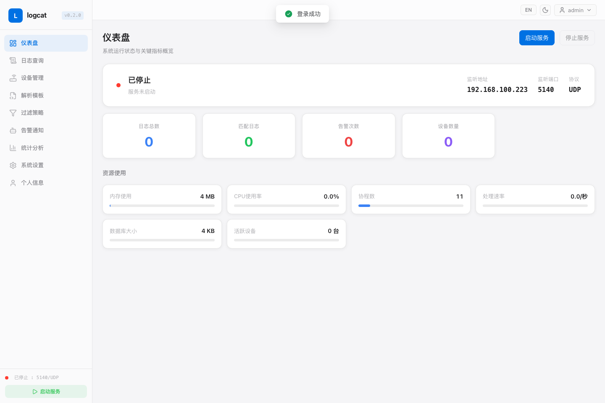
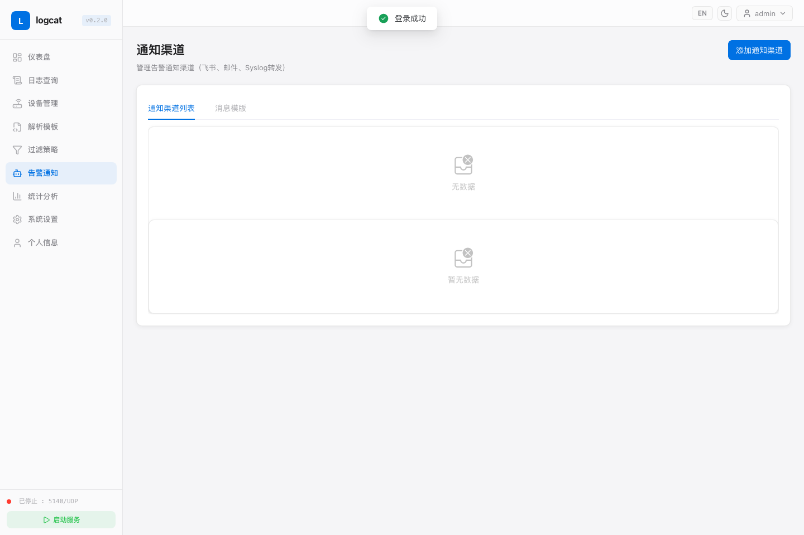
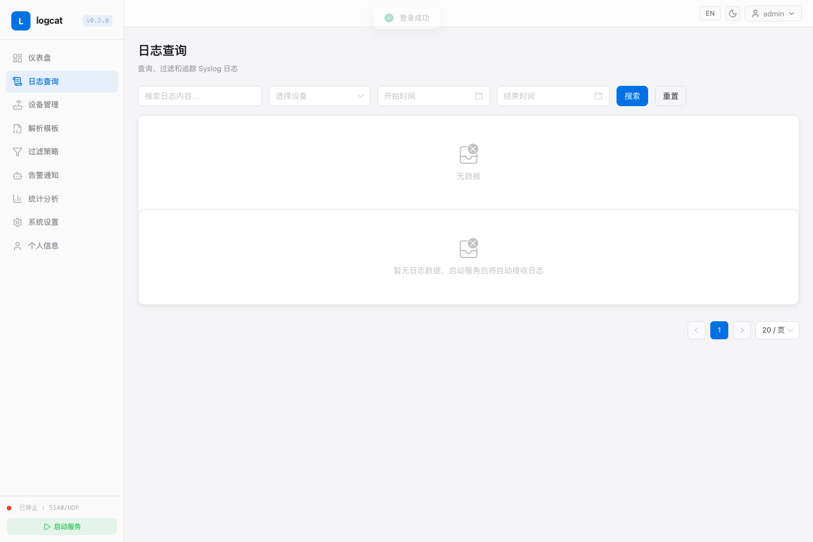

# logcat

[中文 README](../README-zh.md) · [GitHub Repository](https://github.com/jincaiw/logcat)

logcat is a lightweight Syslog alert pipeline for receiving, parsing, filtering, forwarding, and sending alerts from security device logs.

## Screenshots







## Quick Start

### Docker Compose

```bash
curl -O https://raw.githubusercontent.com/jincaiw/logcat/v0.2.7/docker-compose.yml
docker compose up -d
```

Open `http://localhost:8080`.

Default account: `admin / admin123`. Change the password after first login.

### Linux installer

```bash
curl -fsSL https://raw.githubusercontent.com/jincaiw/logcat/v0.2.7/scripts/install-linux.sh | sudo bash
```

## Documentation

- [Installation Guide](installation.html)
- [User Guide](user-guide.html)
- [Release Process](release-process.md)

## Supported notification channels

- Feishu
- Email
- HTTP API
- Syslog forwarding
